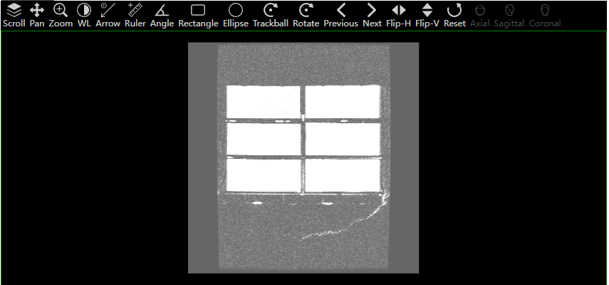
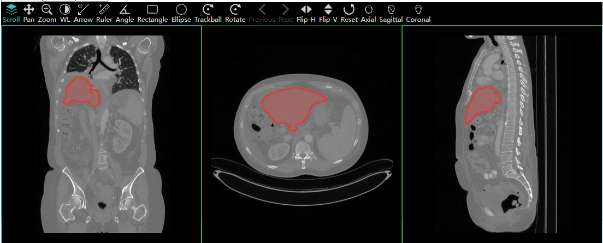
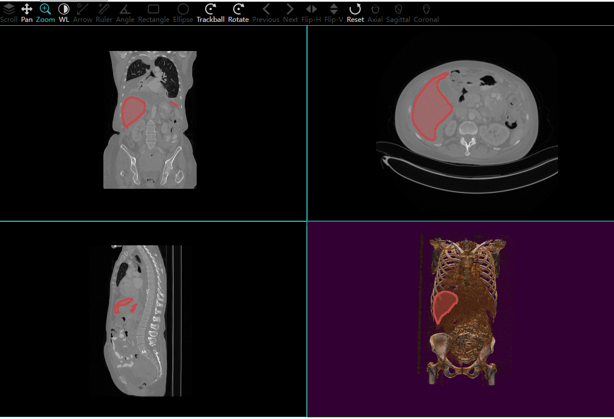

# NgCornerstone

[](https://github.com/prettier/prettier)
[](http://commitizen.github.io/cz-cli/)
[](https://app.netlify.com/sites/angular-cornerstone-demo/deploys)

This is an angular component for [CornerStone3D](https://www.cornerstonejs.org/)

[Netlify Online DEMO](https://angular-cornerstone-demo.netlify.app/)

It can be used as a viewer of DICOM images and NIFTI images.

- Support WADO-RS
- Support Nifti
- Support stack view
- Support MPR view
- Support Volume3D view
- Support segment display
- Tool list is configurable

Integration needs only 3 steps.

## Preview

### stack view



### MPR view



### Volume3D and mpr view



## Integration

1. Run `ng add ng-cornerstone`
2. Edit `angular.json` to import icon sprites files

```
...
"architect": {
  "build": {
      ...
      "assets": [
        ...
        {
          "glob": "**/*",
          "input": "./node_modules/ng-cornerstone/src/assets",
          "output": "/assets/"
        }
...
```

3. Import ViewerModule and nc-viewer

```ts
@NgModule({
  imports: [ViewerModule.forRoot()]
})
```

```html
<nc-viewer [toolList]="toolList" [imageInfo]="imageInfo" [segmentInfo]="segmentInfo" [layout]="layout"></nc-viewer>
```

## Configuration

### ToolList support follow tools:

- AngleTool,
- ArrowAnnotateTool,
- EllipticalROITool,
- LengthTool,
- PanTool,
- RectangleROITool,
- StackScrollTool,
- TrackballRotateTool,
- WindowLevelTool,
- ZoomTool
- FlipV
- FlipH,
- Rotate
- Next
- Previous
- Coronal
- Axial
- Sagittal

### ImageInfo

should provide studyInstanceUID, seriesInstanceUID, urlRoot, viewportType, schema
like:

#### Orthographic and WADO-RS

```
{
  studyInstanceUID: '1.3.6.1.4.1.14519.5.2.1.7009.2403.334240657131972136850343327463',
  seriesInstanceUID: '1.3.6.1.4.1.14519.5.2.1.7009.2403.226151125820845824875394858561',
  urlRoot: 'https://d1qmxk7r72ysft.cloudfront.net/dicomweb',
  viewportType: Enums.ViewportType.ORTHOGRAPHIC,
  schema: RequestSchema.WadoRs,
}
```

#### Volume3D

```js
{
  viewportType: Enums.ViewportType.VOLUME_3D;
}
```

#### Nifti

```ts
imageInfos = [
  {
    studyInstanceUID: '1.2.392.200055.5.4.80861305518.20150928153455671288',
    seriesInstanceUID: '1.2.392.200036.9142.10002202.1020869001.2.20150928174647.30151',
    urlRoot: 'http://example.com/ABD_LYMPH_006/fe0ace7a-b70a-43bc-9eb0-52359b4d2241/Images/ABD_LYMPH_006.nii',
    // urlRoot: 'http://example.com/ABD_LYMPH_006/fe0ace7a-b70a-43bc-9eb0-52359b4d2241/Images/ABD_LYMPH_006.nii.gz',
    viewportType: Enums.ViewportType.VOLUME_3D,
    // viewportType: Enums.ViewportType.ORTHOGRAPHIC,
    schema: RequestSchema.nifti,
  },
];
```

### Layout

Layout supports 4 types:

```ts
LayoutEnum.LAYOUT_1x1, // Single viewport layout
LayoutEnum.LAYOUT_1x2, // 1 row 2 columns layout
LayoutEnum.LAYOUT_1x3, // 1 row 3 columns layout
LayoutEnum.LAYOUT_2x2, // 2 rows 2 columns layout
```

Characteristics of each layout type:

- **LAYOUT_1x1**: Single viewport layout, suitable for traditional 2D DICOM image viewing or single-perspective 3D views
- **LAYOUT_1x2**: 1 row 2 columns layout, can display two views simultaneously, ideal for comparative analysis
- **LAYOUT_1x3**: 1 row 3 columns layout, suitable for MPR (Multi-Planar Reconstruction), can display three orthogonal views simultaneously
- **LAYOUT_2x2**: 2 rows 2 columns layout, provides four viewport panes, best for complete visualization with 3D volume rendering + three orthogonal planes

Default viewport configuration for volume data (non-STACK type) in different layouts:

- **LAYOUT_1x1**: Displays the view corresponding to the viewportType specified in imageInfo
- **LAYOUT_1x2**: Displays sagittal view and 3D volume view
- **LAYOUT_1x3**: Displays sagittal, axial, and 3D volume views
- **LAYOUT_2x2**: Displays sagittal, axial, coronal, and 3D volume views

You can easily switch between different display modes by setting the layout property:

```html
<nc-viewer [layout]="LayoutEnum.LAYOUT_2x2"></nc-viewer>
```

### ToolList support follow tools:

## Troubleshooting

### ng serve failed, try to edit tsconfig.json

```json
{
  "compilerOptions": {
    "skipLibCheck": true
  }
}
```

### Enable WASM

To enable dynamic-import cornerstoneWADOImageLoader, you can use `@angular-builders/custom-webpack`.
The angular json should like:

```
"architect": {
  "build": {
    "builder": "@angular-builders/custom-webpack:browser",
    "options": {
      "customWebpackConfig": {
        "path": "./extra-webpack.config.js",
        "mergeRules": {
          "externals": "replace"
        }
      },
      "assets": [
        ...
        {
        "glob": "**/*",
        "input": "./node_modules/@cornerstonejs/dicom-image-loader/dist/dynamic-import",
        "output": "/"
        }
      ]
    }
  }
}
```

extra-webpack.config.js should like:

```js
module.exports = {
  resolve: {
    fallback: {
      fs: false,
      path: require.resolve('path-browserify'),
    },
  },
  plugins: [],
  module: {
    rules: [
      {
        test: /\.wasm/,
        type: 'asset/resource',
      },
    ],
  },
};
```

### Enable Webworker

Create a tsconfig file for worker and Edit `angular.json` :

```

"webWorkerTsConfig": "./tsconfig.worker.json",

```

## Test Data

Test files are available in the `data` folder, supporting both DICOM and NIFTI formats.

### DICOM Testing with Orthanc

1. Install Orthanc DICOM server
2. Import your DICOM data into Orthanc
3. Configure DICOM-web access

For CORS configuration, you have two options:

#### Option 1: Recommend Using Angular Dev Server Proxy

```bash
ng serve --proxy-config proxy.conf.json
```

#### Option 2: Using Nginx Docker Container

```bash
"orthanc": "docker run --name orthanc-nginx-proxy -v ng-corner/orthanc:/etc/nginx/conf.d:ro -p 8080:80 -d nginx",
```

### NIFTI Testing with HTTP-SERVER

```bash
npm install -g http-server
```

navigate to the data folder and run:

```bash
http-server --cors
```

## Contribution

1. ng-cornerstone is the library.
2. ncv-example is an example app of ng-cornerstone
3. ng-playground is an angular app depends on @cornerstonejs directly.
